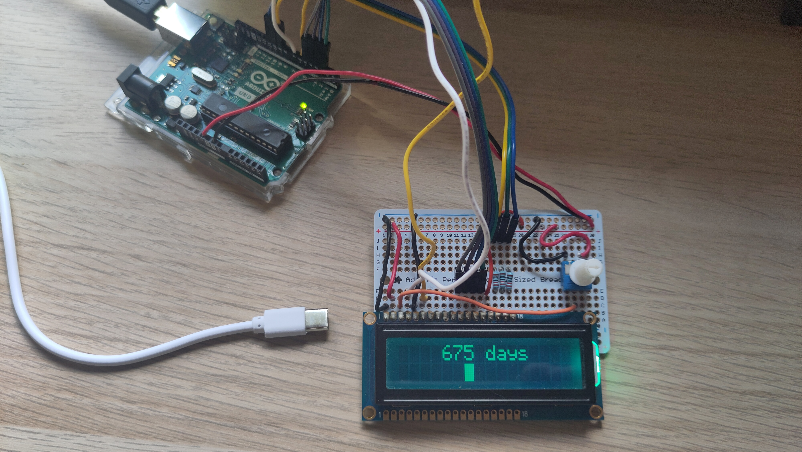
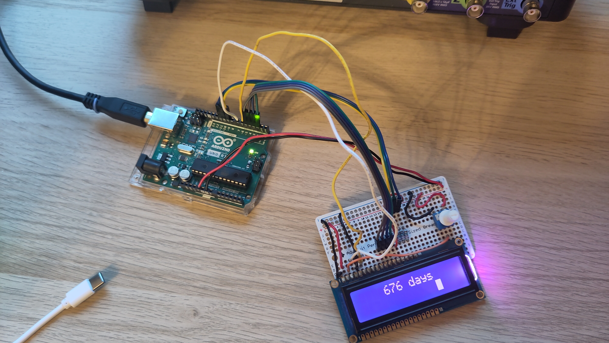
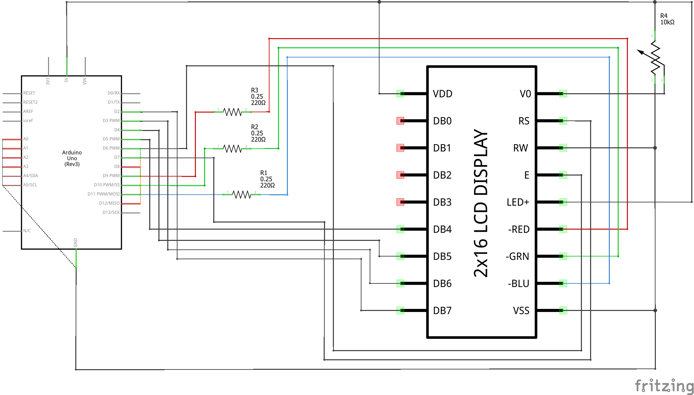

# Arduino LCD Transition Days
An Arduino project that I created to show the number of days since I started my transition (as a transgender person) on an LCD screen.

But really you can use the project for any use case where you would want to see the number of days since some event.

## LCD Rainbow Test
See LCD_rainbow folder.

This is a small demo of changing the LCD screen backlight colors going through the rainbow. Can be used as a test before deploying the main project.

## LCD Transition Days
See LCD_transition_days folder.

This is the main project.

Features:
* Shows the number of days since some event (that's the main purpose).
* Saves in EEPROM the numbers of hours since event, so that if the Arduino is restarted it looses at most 1 hour.
  * The 1 hour resolution is a tradeoff betweem accuracy and EEPROM life which is limited to 100,000 write cycles (cf https://docs.arduino.cc/learn/built-in-libraries/eeprom/). This ensures that the program can run for about 10 years before the EEPROM is burnt.
* Shows a square in the 2nd line of the LCD showing where we are approximately during the day.
* The backlight is a color of the rainbow corresponding to the time of day.

Here are some pictures:

675 days - in the morning

676 days - in the evening

## Hardware
* Arduino Uno R3
* 2x16 LCD display with 3-color LED backlight (I used this: https://www.adafruit.com/product/399)
* 10 kohm potentiometer to adjust LCD screen contrast (or you can put the "correct" resistor if you prefer)

## Schematic

